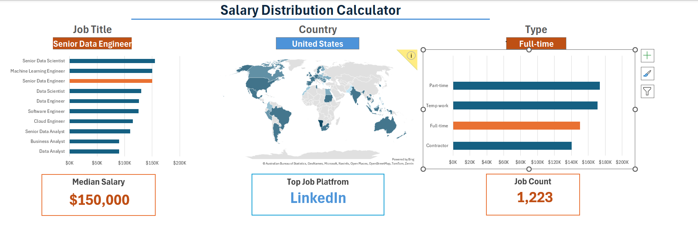
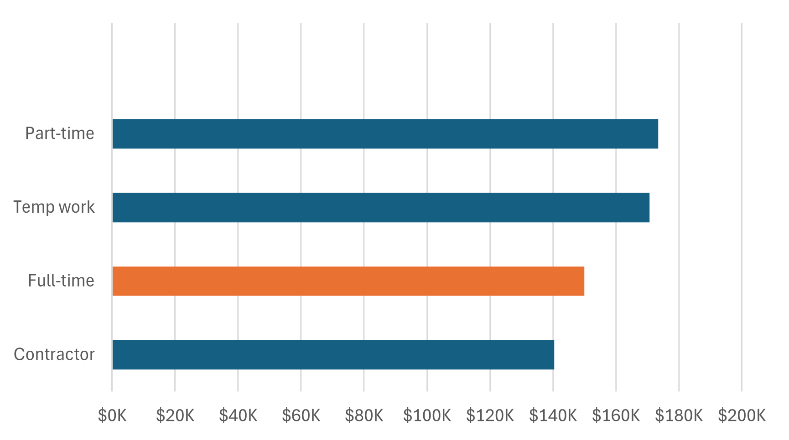
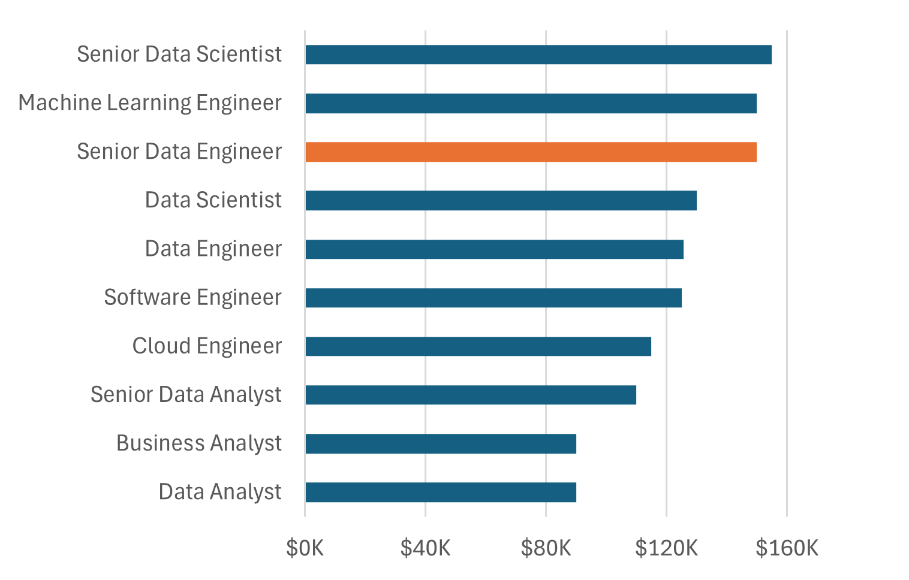

# 📊 Salary Distribution Calculator (Excel Dashboard)

  

  <b>Excel Dashboard for Job Market Salary Analysis</b> 
  Interactive • Visual 

---

## 🚀 Project Overview
The **Salary Distribution Calculator** is an interactive Excel dashboard built to analyze **job market salary trends** across different **job titles and employment types**.  
This project converts raw job market data into **actionable insights** using Excel analytics and visualizations.

---

## 🎯 Project Objectives
- Analyze salary distribution across job roles  
- Compare salaries by **employment type** (Full-time, Part-time, Contract, Temp)  
- Identify **high-paying job titles**  
- Present insights through a clean, interactive dashboard  

---

## 🛠 Tools & Techniques Used
- Microsoft Excel  
- Pivot Tables & Pivot Charts  
- Excel Formulas (IF, AVERAGE, COUNTIFS)  
- Conditional Formatting  
- Slicers & Filters  
- Dashboard Design  

---

## 📈 Dashboard Walkthrough

### 🔹 Overall Dashboard View

  

**Key KPIs Displayed:**
- Median Salary  
- Job Count  
- Top Job Platform  
- Selected Job Title & Employment Type  

---

### 🔹 Salary by Employment Type

  

**Insight:**  
- Full-time roles show stable and higher salary ranges  
- Contract and temporary roles offer competitive but variable pay  

---

### 🔹 Salary by Job Title

  

**Insight:**  
- Senior technical roles dominate top salary brackets  
- Analyst-level roles show consistent entry-to-mid level compensation  

---

## 📌 Key Insights Summary
- Senior roles command the highest salaries  
- Employment type significantly impacts compensation  
- Excel dashboards effectively communicate salary trends  
- Visual analytics simplify decision-making  

---

